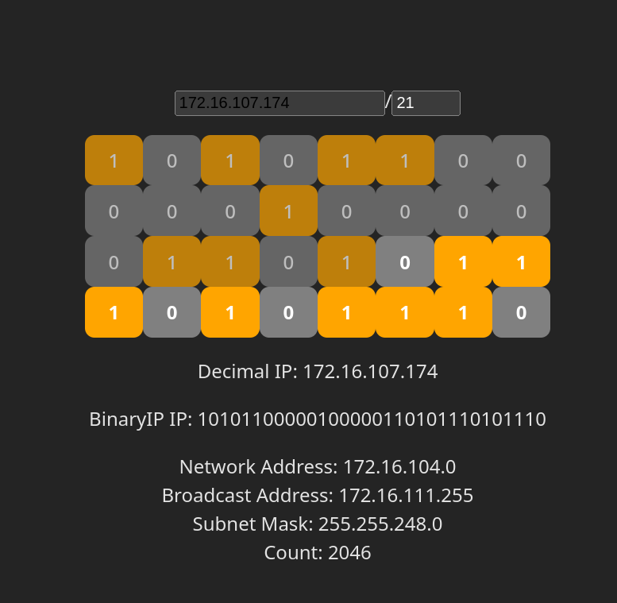

# IP Calc

[](https://gitlab.aiursoft.com/anduin/ipcalc/-/commits/master?ref_type=heads)



## Run in Docker

First, install Docker [here](https://docs.docker.com/get-docker/).

Then run the following commands in a Linux shell:

```bash
image=hub.aiursoft.cn/anduin/ipcalc
appName=ipcalc
sudo docker pull $image
sudo docker run -d --name $appName --restart unless-stopped -p 5000:5000 $image
```

That will start a web server at `http://localhost:5000` and you can test the app.

The docker image has the following context:

| Properties  | Value                                  |
|-------------|----------------------------------------|
| Image       | hub.aiursoft.cn/anduin/ipcalc          |
| Ports       | 5000                                   |
| Binary path | /app                                   |
| Data path   | /data                                  |
